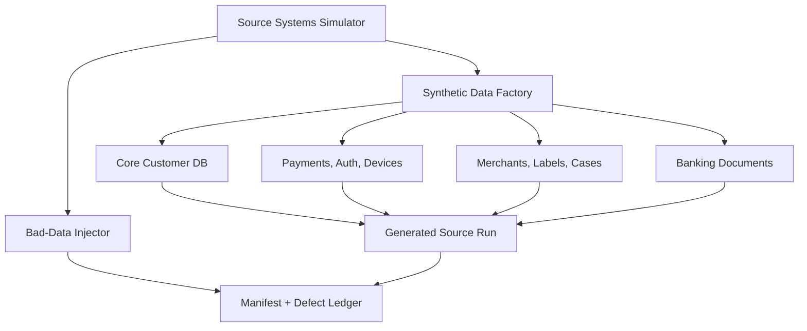
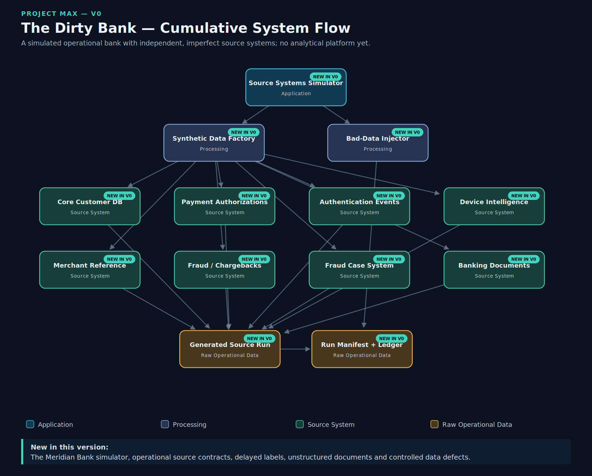

# Project MAX

Project MAX is one cumulative prototype of a banking Data and AI Factory. Version 0, **The Dirty Bank**, creates the imperfect operational world that later versions must learn to ingest, govern, analyse and operate.

This repository currently implements **V0 only**.

## What works in V0

- Meridian Bank core customer and fraud-case PostgreSQL schemas
- synthetic customers, accounts, cards, addresses and status history
- payment authorization and authentication JSON event feeds
- device-intelligence JSON snapshots
- daily merchant-reference CSV feeds
- delayed fraud and chargeback labels
- structured fraud cases with unstructured investigator notes
- synthetic PDF, DOCX, TXT and HTML banking documents
- an image-only PDF reserved for later OCR testing
- all 15 deliberately bad-data classes required by the roadmap
- a defect ledger, run manifest, counts and SHA-256 file checksums
- a CLI, committed demonstration run and Streamlit Source Systems Simulator
- a reusable, definition-driven System Flow Viewer

All people, transactions, devices, merchants, cases and documents are synthetic. No AWS resources are used.

## Architecture



The generated run directory is a convenient prototype-scale representation of raw operational artifacts. It is **not** an analytical data lake. The complete interactive V0 architecture is available from **View System Flow** in Streamlit.



## Repository map

| Path | Purpose |
|---|---|
| `src/project_max/` | Reusable Python generation, persistence and inspection logic |
| `source-systems/` | Operational schemas, source documentation and a committed sample run |
| `frontend/streamlit/` | Source Systems Simulator and reusable System Flow Viewer |
| `config/` | Human-readable V0 defaults |
| `scripts/` | Explicit demo and PostgreSQL bootstrap helpers |
| `tests/` | Unit tests and opt-in PostgreSQL integration test |
| `docs/` | Architecture, decisions, cost, evidence and version boundary |

Future versions may add new top-level platform modules, but should not move or rewrite V0 simply to accommodate them.

## Quick start: file mode

Requirements: Python 3.11 or 3.12.

```bash
python -m venv .venv
# Windows PowerShell: .venv\Scripts\Activate.ps1
# macOS/Linux: source .venv/bin/activate
python -m pip install -e ".[dev]"
python -m project_max.cli generate --output .local-data/my-first-run --include-defects
python -m streamlit run frontend/streamlit/app.py
```

The app opens locally and can generate customers, transactions, fraud-focused runs and bad records. It also inspects every generated source artifact.

The committed example is at `source-systems/sample-data/v0-demo` and was created with:

```bash
python scripts/generate_v0_demo.py
```

Generation refuses to overwrite a non-empty run directory. Each run is intended to remain immutable evidence.

## PostgreSQL mode

PostgreSQL 15+ is the only server dependency. The application never creates credentials and never commits a password.

Max must first create a local database and login, then set:

```bash
export MAX_DATABASE_URL="postgresql://max_app:<your-password>@localhost:5432/max_bank"
# Windows PowerShell:
# $env:MAX_DATABASE_URL="postgresql://max_app:<your-password>@localhost:5432/max_bank"
```

Then run:

```bash
python -m project_max.cli bootstrap-db
python -m project_max.cli load-db source-systems/sample-data/v0-demo
```

Exact human steps and the security boundary are documented in [`docs/source-systems/postgresql.md`](docs/source-systems/postgresql.md).

## Tests and quality checks

```bash
python -m ruff check .
python -m pytest
```

The PostgreSQL integration test runs only when `MAX_TEST_DATABASE_URL` points to a disposable test database. It is skipped otherwise, preventing an accidental write to the development database.

## Important V0 concepts

**Independent source systems:** the customer database, payment events, authentication events, merchant files and case records have different formats and delivery behaviour. A bank does not begin as one DataFrame.

**Delayed label:** a transaction occurs now, but the customer may report fraud several days later. The fraud answer therefore cannot be joined to the transaction using processing time alone.

**Defect ledger:** every intentional failure has an ID, type, target record/file and explanation. Later versions can measure which defects were detected rather than claiming success from an unknown dataset.

**Run manifest:** the manifest records configuration, counts, file sizes and SHA-256 checksums. A checksum is a compact fingerprint; if a file changes, its fingerprint almost certainly changes too.

## Deliberately absent until later versions

V0 has no S3 data lake, Kafka, PySpark, Airflow, curated data, ML, feature store, FastAPI fraud service, AWS foundation, CI/CD, Kubernetes, GPU workload, OCR pipeline, vector database, RAG or agent. Their absence is an architectural decision, not an unfinished V0 feature.

See [`docs/version-boundaries/v0.md`](docs/version-boundaries/v0.md) for the exact hand-off to V1.

## Cost

AWS cost: **₹0**. V0 runs locally with free/open-source dependencies.
